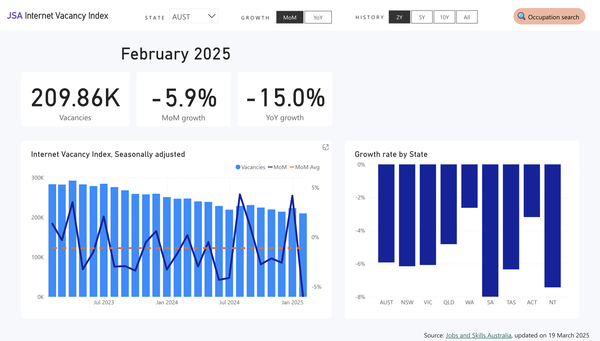
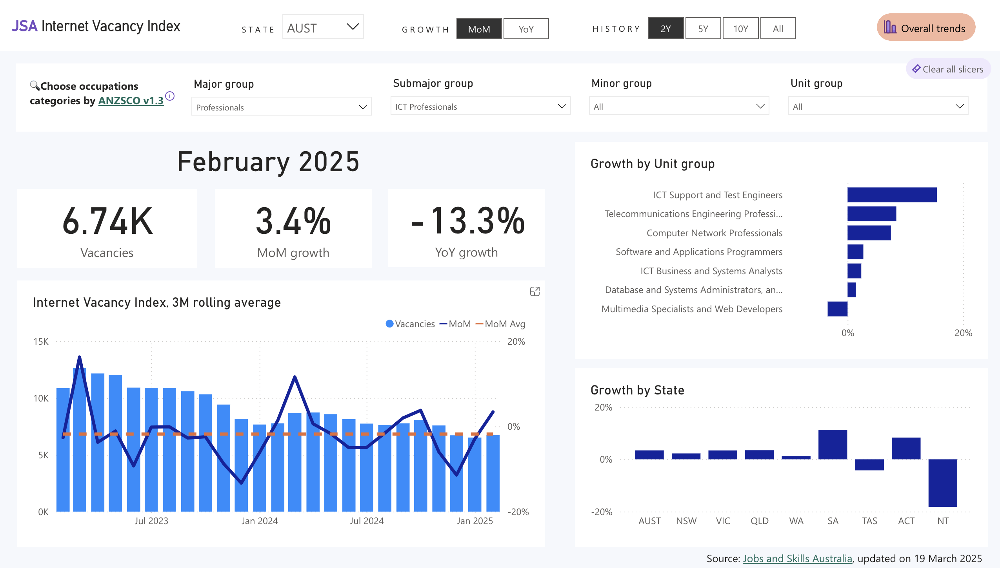

# Power BI dashboard for JSA Internet Vacancy Index

## Aim
To create a frontend for Jobs and Skills Australia's [**Internet Vacancy Index (IVI)**](https://www.jobsandskills.gov.au/data/internet-vacancy-index).

## Motivation
Some reasons to create a frontend are:
1. Improving Accessibility & Usability
    - The IVI data is currently available in static reports or spreadsheets.
    - A frontend dashboard with interactive visualisations makes it easier to explore trends in job vacancies across time, occupations and locations.
2. Enhancing Policy & Business Decision-Making
    - Government agencies, businesses, and job seekers rely on IVI data to understand labor market trends.
    - A well-designed dashboard could provide real-time insights into skill shortages, regional job demand, and employment opportunities.
3. Personal & Professional Development
    - As a data analyst with expertise in economics and data visualisation, this project can showcase your ability to build end-to-end solutions.
    - Demonstrates technical skills in frontend development (React, Astro.js, D3.js), API integration, and data storytelling.
    - Adds a portfolio piece relevant to my career goals in economic and financial data analytics.
4. Public Good & Open Data Advocacy
    - Open data projects like this increase public engagement with government statistics.
    - Encourages transparency and helps economists, policymakers, and businesses make better decisions.

## Progress
Produced a working version and published to the web. [Link](https://app.powerbi.com/view?r=eyJrIjoiNzIzNTU0ZDktOGZjOC00NDdjLTg3NjItMGFlOWE4MzEzYWU4IiwidCI6IjA0Y2EyZDBiLTliZmItNDQyYS05MmQwLTEwZTQ0MDQzZjNlNCJ9&pageName=Overall)

In the current verison, the dashboard contains two pages: 1. Overall trends, and 2. Search by occupation.

Below is an embeded Power BI dashboard:

<iframe title="ivi" width="600" height="373.5" src="https://app.powerbi.com/view?r=eyJrIjoiNzIzNTU0ZDktOGZjOC00NDdjLTg3NjItMGFlOWE4MzEzYWU4IiwidCI6IjA0Y2EyZDBiLTliZmItNDQyYS05MmQwLTEwZTQ0MDQzZjNlNCJ9&pageName=Overall" frameborder="0" allowFullScreen="true"></iframe>

## TODO
- In the current version, the dashboard requires the analyst to run the Python code each time data is updated and then manually refresh the Power BI file and reupload to Power BI web service. **Ideally the entire workflow should be automated**.
- The rough steps to accomplish this are as follows:
    1. Find out when the data will be updated
    2. Automate running Python script when data is updated
    3. Use BeautifulSoup or similar Python package to scrape the website to download the data files
    4. Upload data to AWS Redshift (?)
    5. Force Power BI refresh from data source